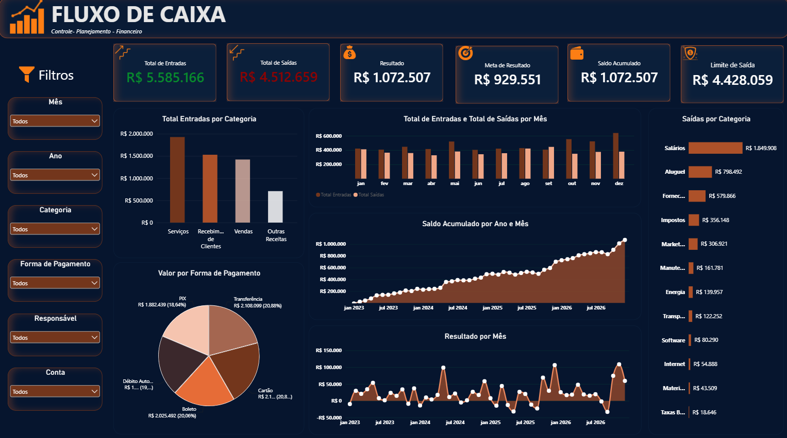

# Projeto 04 — Análise de Fluxo de Caixa | Power BI

## Sobre o projeto

Uma empresa pode movimentar milhões em entradas e saídas e, ainda assim, não ter uma visão clara de sua situação financeira.

Saber quanto entrou e quanto saiu é importante, mas não é suficiente. Também é necessário entender como o resultado evolui ao longo do tempo, quais categorias concentram os maiores gastos e se o desempenho está acompanhando aquilo que foi planejado.

Foi a partir desse cenário que surgiu este projeto.

A proposta foi desenvolver um dashboard de Business Intelligence para análise de fluxo de caixa, utilizando dados financeiros de 2023 a 2026 e uma estrutura de metas mensais para comparar o desempenho realizado com o esperado.

O objetivo foi transformar os lançamentos financeiros em uma visão simples e objetiva, permitindo analisar o comportamento do caixa e acompanhar seus principais indicadores.

## Dashboard



## O que eu queria descobrir?

Durante a construção do projeto, algumas perguntas orientaram a análise:

- Quanto entrou e quanto saiu ao longo do período?
- Como o resultado financeiro evoluiu mês a mês?
- Como o saldo acumulado se comportou?
- Quais categorias concentram os maiores valores de saída?
- Quais formas de pagamento movimentam mais dinheiro?
- O resultado realizado está acompanhando a meta?
- Como o comportamento financeiro muda entre diferentes anos e meses?

Essas perguntas ajudaram a definir os indicadores, gráficos e filtros utilizados no dashboard.

## Construção da solução

O projeto foi desenvolvido seguindo um fluxo de trabalho de Business Intelligence:

**Dados → Tratamento → Modelagem → DAX → Dashboard → Análise**

### Organização dos dados

A base contém lançamentos financeiros entre 2023 e 2026, com informações como:

- Data
- Tipo de movimentação
- Categoria
- Descrição
- Conta
- Forma de pagamento
- Status
- Valor
- Responsável

Além dos lançamentos financeiros, foi criada uma tabela específica com metas mensais, permitindo comparar o desempenho realizado com os valores planejados.

## Modelagem no Power BI

A estrutura do projeto foi organizada para facilitar as análises financeiras e temporais.

As principais tabelas utilizadas foram:

- `tbl_Fluxo_Caixa`
- `Metas_Fluxo_Caixa`
- `Calendario`
- `Dim_Mes`

Também foi criada uma tabela calendário para permitir análises por ano, mês e período.

Durante a construção do modelo, foi necessário trabalhar os relacionamentos entre os dados financeiros, o calendário e a tabela de metas para que os filtros do dashboard funcionassem corretamente.

## Medidas e indicadores

Com o modelo estruturado, foram criadas medidas em DAX para transformar os lançamentos em indicadores financeiros.

Entre os principais indicadores estão:

- Total de Entradas
- Total de Saídas
- Resultado
- Saldo Acumulado
- Meta de Resultado
- Limite de Saídas

Também foram utilizadas medidas para permitir a comparação entre os valores realizados e as metas definidas para cada período.

Um dos pontos trabalhados durante o desenvolvimento foi fazer com que as metas acompanhassem corretamente os filtros de ano e mês selecionados no dashboard.

## O dashboard

O dashboard foi desenvolvido buscando equilibrar clareza, análise e impacto visual.

A parte superior apresenta os principais indicadores financeiros, permitindo entender rapidamente o cenário do período selecionado.

Os gráficos apresentam diferentes perspectivas do fluxo de caixa:

- Entradas e saídas por mês
- Resultado por mês
- Saldo acumulado por ano e mês
- Entradas por categoria
- Saídas por categoria
- Valores por forma de pagamento

Também foram utilizados filtros para permitir uma exploração mais detalhada dos dados.

A proposta visual buscou fugir de um dashboard financeiro excessivamente tradicional, mantendo uma aparência mais moderna e objetiva, sem comprometer a leitura das informações.

## Metas x Realizado

Uma das principais características deste projeto foi adicionar uma camada de planejamento à análise.

Em vez de observar somente o histórico financeiro, o dashboard permite acompanhar o desempenho em relação às metas estabelecidas para cada período.

A estrutura considera:

- **Meta de Entradas**
- **Limite de Saídas**
- **Meta de Resultado**

A partir disso, é possível analisar não apenas o que aconteceu, mas também como o resultado realizado se comporta em relação ao que havia sido planejado.

## Principais indicadores do dashboard

### Total de Entradas

Valor total das entradas financeiras no período selecionado.

### Total de Saídas

Valor total das saídas financeiras.

### Resultado

Diferença entre as entradas e as saídas.

### Meta de Resultado

Resultado esperado de acordo com as metas estabelecidas.

### Saldo Acumulado

Evolução acumulada do resultado financeiro ao longo do período.

### Limite de Saídas

Valor máximo de saídas estabelecido pelas metas para o período analisado.

## O que este projeto me trouxe

Este projeto teve um foco maior em Business Intelligence e Power BI.

Mais do que construir gráficos, o objetivo foi trabalhar todo o processo de transformar dados financeiros em uma ferramenta de análise.

Durante sua construção, trabalhei principalmente com:

- Modelagem de dados no Power BI
- Relacionamentos entre tabelas
- Criação de calendário
- DAX
- Inteligência temporal
- Indicadores financeiros
- Metas e comparação com realizado
- Filtros e interações
- Organização visual de dashboards
- Experiência de leitura das informações

O principal aprendizado foi entender que um dashboard não começa pelos gráficos.

Antes de escolher um visual, é necessário entender qual pergunta precisa ser respondida e qual informação realmente ajuda nessa resposta.

## Tecnologias utilizadas

- Power BI
- DAX
- Power Query
- Excel

## Arquivos do projeto

```text
Projeto 04 — Fluxo de Caixa
│
├── Dashboard-Fluxo-de-Caixa.pbix
├── Projeto_04_Fluxo_de_Caixa_2023_2026.xlsx
├── fluxo_de_caixa.png
└── README.md
